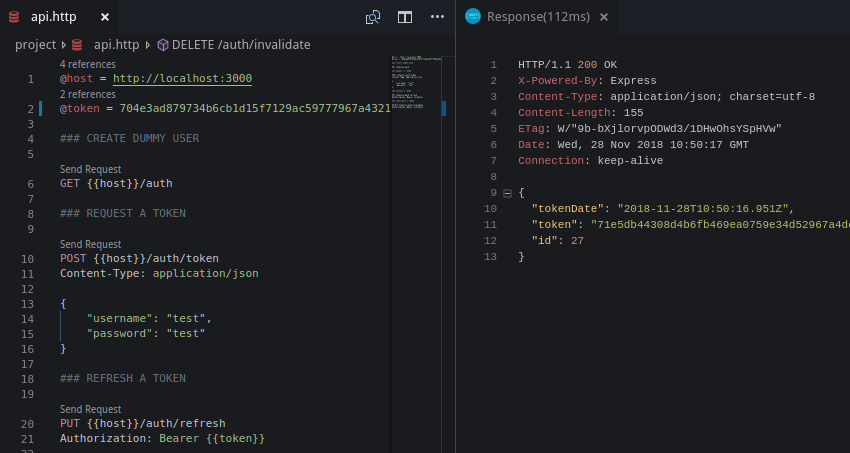

# Authentification

## Règles à implémenter

Prenons comme exemple la création d'une API. Les utilisateurs s'authentifieront à l'aide de leur nom d'utilisateur \(ou leur email\) et leur mot de passe. L'authentification sera gérée sous la forme d'un jeton généré et unique.


Afin de simplifier les exemples, nous n'implémenterons pas une authentification OAuth2 \(avec `client_id`, `client_secret`\). Nous allons simplement implémenter la stratégie [Bearer](https://www.npmjs.com/package/passport-bearer-strategy).


Nous allons construire l'API d'authentification avec 3 points d'entrée :

* Demande de jeton `POST:/auth/token`.
* Rafraîchissement de jeton `PUT:/auth/refresh`.
* Invalidation de jeton `DELETE:/auth/invalidate`.

Nous allons nous servir de [Passport](http://www.passportjs.org/) pour gérer la correspondance jeton &lt;&gt; utilisateur. Pour la génération de jeton, nous allons nous baser sur un [uuid](https://www.npmjs.com/package/uuid) ainsi qu'une composante aléatoire avec [random-hex-string](https://www.npmjs.com/package/random-hex-string). 

## Modulé dédié

Générons un module dédié à l'authentification :

```bash
$ nest generate module auth
```

## Installation du composant

Nest possède un [module d'intégration de passport](https://docs.nestjs.com/techniques/authentication), qui facilite cette authentification.

Installons les packages nécessaires :

```bash
$ npm install --save @nestjs/passport passport passport-http-bearer random-hex-string uuid
```

Ensuite, déclarons la configuration de passport via le module de Nest :



```typescript
import { Module } from '@nestjs/common';
import { PassportModule } from '@nestjs/passport';

@Module({
  imports: [
    PassportModule.register({
      defaultStrategy: 'bearer'
    }),
  ]
})
export class AuthModule {}
```



## Mise en place des éléments

Pour que tout fonctionne correctement, nous avons besoin :

* d'un modèle reflétant les jetons, leur date de création.
* d'un service qui aura comme rôle de récupérer le jeton en base de donnée correspondant à un jeton passé en paramètre.
* d'une stratégie d'authentification, qui se chargera de gérer la validité du jeton.
* d'un contrôleur qui exposera les 3 points d'entrée décrits précédemment.


Référez-vous au dépôt suivant pour avoir tous les éléments de ce tutoriel : [https://github.com/PapsOu/nest-tutorial/tree/35d5d86917d0ea4402a186ca7ed577f0fc821ef1](https://github.com/PapsOu/nest-tutorial/tree/35d5d86917d0ea4402a186ca7ed577f0fc821ef1), notamment pour voir la gestion utilisateur ultra-basique qui n'est pas décrite dans cette section.


### Le modèle de jeton

Créons une entité qui sera composée de 3 champs : `id`, `token`, `tokenDate`.

```bash
$ nest generate class auth/entity/token
```



```typescript
import { Entity, PrimaryGeneratedColumn, Column } from "typeorm";

@Entity()
export class Token {
  @PrimaryGeneratedColumn()
  id!: number

  @Column('varchar', {
    length: 128,
    unique: true,
    nullable: false,
  })
  token!: string

  @Column("text", {
    nullable: false
  })
  tokenDate: Date = new Date()
}
```



Déclarons notre nouvelle entité dans son module :



```typescript
import { Module } from '@nestjs/common';
import { PassportModule } from '@nestjs/passport';
import { TypeOrmModule } from '@nestjs/typeorm';

import { TokenService } from '@auth/service/token.service';
import { Token } from '@auth/entity/token.entity';

@Module({
  imports: [
    PassportModule.register({
      defaultStrategy: 'bearer'
    }),
    TypeOrmModule.forFeature([
      Token
    ])
  ],
  providers: [TokenService]
})
export class AuthModule {}
```



N'oublions pas de déclarer l'entité dans le module principal



```typescript
import { Module } from '@nestjs/common';
import { TypeOrmModule } from '@nestjs/typeorm';

import { AuthModule } from '@auth/auth.module';

import { User } from '@user/entity/user.entity';
import { Token } from '@auth/entity/token.entity';


@Module({
  imports: [
    TypeOrmModule.forRootAsync({
      useFactory: () => ({
        // [...]
        entities: [
          User,
          Token
        ],
      })
    }),
    AuthModule,
    // [...]
  ],
})
export class AppModule { }
```



### Le service de jeton

Le service exposera 3 méthodes :

* Création de jeton
* Récupération de jeton
* Suppression de jeton
* Génération d'un jeton unique \(chaîne\)

Générons un service dans le module `@auth`:

```bash
$ nest generate service auth/service/token --flat
```



```typescript
import * as uuid from 'uuid/v4'
import * as randomHex from 'random-hex-string'
import { Injectable } from '@nestjs/common';
import { Token } from '@auth/entity/token.entity';
import { Repository } from 'typeorm';
import { InjectRepository } from '@nestjs/typeorm';
import { User } from '@user/entity/user.entity';

@Injectable()
export class TokenService {
  constructor(
    @InjectRepository(Token) private readonly repository: Repository<Token>
  ) { }

  public async createToken(user: User): Promise<Token> {
    const token = await this.repository.create()

    token.token = this.generateUniqueToken()

    // Remove existing token if necessary
    if (user.token) {
      await this.deleteToken(user.token.id)
    }
    // Associate user and token together
    user.token = token

    return await this.repository.save(token)
  }

  public async getToken(token: string): Promise<Token | undefined> {
    return await this.repository.findOne({
      token: token
    })
  }

  public async deleteToken(id: number): Promise<boolean> {
    await this.repository.delete(id)

    return true
  }

  public generateUniqueToken(): string {
    const tokenUniquePart = uuid().replace(/\-/g, '')
    const token = randomHex.sync(tokenUniquePart.length)

    return tokenUniquePart.concat(token)
  }
}
```



La méthode `getToken()`, par le biais d'un repository, récupère l'entité Token qui correspond au jeton passé en paramètre. Cette méthode sera utilisée par la stratégie d'authentification.

### La stratégie d'authentification

La stratégie sera appelé par un décorateur [`@guard`](https://docs.nestjs.com/guards) placé sur les méthodes des contrôleurs que l'on souhaite rendre accessibles uniquement aux utilisateurs identifiés.

Générons notre stratégie :

```bash
$ nest generate class auth/strategy/defaultStrategy
```



```typescript
import { Strategy } from 'passport-http-bearer';
import { PassportStrategy } from '@nestjs/passport';
import { Injectable, UnauthorizedException, HttpException, HttpStatus } from '@nestjs/common';

import { TokenService } from '@auth/service/token.service';
import { UserService } from '@user/user.service';
import { User } from '@user/entity/user.entity';

@Injectable()
export class DefaultStrategy extends PassportStrategy(Strategy) {
  constructor(
    private readonly tokenService: TokenService,
    private readonly userService: UserService
  ) {
    super()
  }

  async validate(tokenString: string): Promise<User> {
    const token = await this.tokenService.getToken(tokenString)
    const tokenValidityDuration = Number(process.env.API_TOKEN_TTL)

    if (token === undefined) {
      throw new UnauthorizedException()
    }

    if (new Date(token.tokenDate).getTime() + tokenValidityDuration < new Date().getTime()) {
      throw new HttpException('Token has expired', HttpStatus.UNAUTHORIZED)
    }

    // Fetch user corresponding to token
    const user = await this.userService.getUserByToken(token)

    if (user === undefined) {
      throw new UnauthorizedException()
    }
    
    return user
  }
}
```



C'est cette stratégie qui sera appelée lorsque l'on rajoutera un [Guard](https://docs.nestjs.com/guards) sur une méthode de contrôleur.

### Le contrôleur

Le contrôleur exposera 3 méthodes :

* Demande de jeton `POST:/auth/token`.
* Rafraîchissement de jeton `PUT:/auth/refresh`.
* Invalidation de jeton `DELETE:/auth/invalidate`.

On génère un contrôleur :

```bash
$ nest generate controller auth/controller/token
```



```typescript
import { Controller, Body, HttpException, HttpStatus, Post, Put, Req, Delete, UseGuards, Get } from '@nestjs/common';

import { Token } from '@auth/entity/token.entity';
import { TokenService } from '@auth/service/token.service';
import { RequestTokenDto } from '@auth/dto/request-token.dto';
import { UserService } from '@user/user.service';
import { AuthGuard } from '@nestjs/passport';
import { User } from '@user/entity/user.entity';

@Controller('auth')
export class TokenController {
  constructor(
    private readonly tokenService: TokenService,
    private readonly userService: UserService
  ) { }

  @Post('token')
  public async token(
    @Body() requestTokenDto: RequestTokenDto
  ): Promise<Token> {
    const user = await this.userService.getUserByUsernameAndPassword(
      requestTokenDto.username,
      requestTokenDto.password,
    )

    if (!user) {
      throw new HttpException('Invalid username and/or password', HttpStatus.UNAUTHORIZED)
    }

    const token = await this.tokenService.createToken(user)

    await this.userService.updateUser(user)
    
    return token
  }

  @UseGuards(AuthGuard())
  @Put('refresh')
  public async refresh(
    @Req() request: any
  ): Promise<Token> {
    const token = await this.tokenService.createToken(request.user)

    await this.userService.updateUser(request.user)

    return token
  }

  @UseGuards(AuthGuard())
  @Delete('invalidate')
  public async invalidate(
    @Req() request: any
  ):Promise<boolean> {
    const token = request.user.token

    return await this.tokenService.deleteToken(token.id)
  }

  @Get()
  public async createDummyUser(): Promise<User> {
    return await this.userService.createDummyUser()
  }
}
```



## Utilisation de l'API


Si vous utilisez [Visual Studio Code](https://code.visualstudio.com/), une extension de client REST intégré à l'IDE facilite grandement les interactions avec une API pendant son développement : [REST Client](https://marketplace.visualstudio.com/items?itemName=humao.rest-client).

Vous pouvez trouver le fichier [api.http](https://github.com/PapsOu/nest-tutorial/blob/35d5d86917d0ea4402a186ca7ed577f0fc821ef1/project/api.http) dans le dépôt de cet article.





Dans les exemples suivants, il y a 2 variables : **`@host`** et **`@token`**.

**`{{host}}`** à comme valeur [`http://localhost:3000`](http://localhost:3000)`.`

**`{{token}}`** aura comme valeur le jeton d'authentification \(à changer à chaque changement de jeton\)


On créé un utilisateur de test en appelant cette URL :

```http
GET {{host}}/auth

HTTP/1.1 200 OK
X-Powered-By: Express
Content-Type: application/json; charset=utf-8
Content-Length: 68
ETag: W/"44-yhULEM9BsIvGugQgbdUrWem9g+U"
Date: Wed, 28 Nov 2018 10:33:13 GMT
Connection: keep-alive

{
  "email": "test@test.com",
  "username": "test",
  "password": "test",
  "id": 2
}
```

Ensuite, une fois notre utilisateur de test créé, on s'authentifie sur notre API :

```http
POST {{host}}/auth/token
Content-Type: application/json

{
    "username": "test",
    "password": "test"
}

HTTP/1.1 201 Created
X-Powered-By: Express
Content-Type: application/json; charset=utf-8
Content-Length: 155
ETag: W/"9b-HRUy8NSRRYrO4qoOtLPm/lVmDgE"
Date: Wed, 28 Nov 2018 10:46:52 GMT
Connection: keep-alive

{
  "tokenDate": "2018-11-28T10:46:52.358Z",
  "token": "704e3ad879734b6cb1d15f7129ac59777967a4321c8d8607b238aceb11a7784aaa784817faba807e822078df6108f231",
  "id": 26
}
```

Cette action ne possède pas de contrôle d'accès, car se serai impossible de s'authentifier si l'action était protégée.

Une fois la requête `POST` exécutée, on récupère le jeton généré et on le garde pour les prochaines requêtes \(on remplace la valeur de la variable `@token` par ce nouveau jeton\).

Maintenant, nous allons rafraîchir notre jeton \(on suppose qu'il ne va pas tarder à expirer\) :

```http
PUT {{host}}/auth/refresh
Authorization: Bearer {{token}}

HTTP/1.1 200 OK
X-Powered-By: Express
Content-Type: application/json; charset=utf-8
Content-Length: 155
ETag: W/"9b-bXjlorvpODWd3/1DHwOhsYSpHVw"
Date: Wed, 28 Nov 2018 10:50:17 GMT
Connection: keep-alive

{
  "tokenDate": "2018-11-28T10:50:16.951Z",
  "token": "71e5db44308d4b6fb469ea0759e34d52967a4dcd8beef310366f16e845ad1636378b26a106bc79d6615993ad65419c75",
  "id": 27
}
```

Notez bien l'entête `Authorization` de la requête qui a pour valeur :

```text
Bearer 704e3ad879734b6cb1d15f7129ac59777967a4321c8d8607b238aceb11a7784aaa784817faba807e822078df6108f231
```

C'est grâce à cette entête que l'identification de l'utilisateur peut être réalisée par notre API.

Pour finir, nous allons déconnecter l'utilisateur en invalidant son jeton d'accès :

```http
DELETE {{host}}/auth/invalidate
Authorization: Bearer {{token}}

HTTP/1.1 200 OK
X-Powered-By: Express
Content-Type: text/html; charset=utf-8
Content-Length: 4
ETag: W/"4-X/5TO4MPCKAyY0ipFgr6/IraRNs"
Date: Wed, 28 Nov 2018 11:03:54 GMT
Connection: keep-alive

true
```

Et voila, nous sommes déconnecté.

### Note importante


L'API mise en place dans cet article est un exemple volontairement simplifié d'une API REST. Elle présente beaucoup de failles de sécurité au niveau de la gestion du jeton.


Par exemple, le rafraîchissement du jeton ne doit pas se réaliser avec le même jeton qui sert à identifier l'utilisateur. 

Si un attaquant intercepte des échanges \(en dehors de la première authentification\), il pourra renouveler le jeton et, de ce fait, l'utilisateur légitime se verra refusé l'accès à l'API car son jeton ne sera plus valable.

 Pour cela, il faut faire évoluer le modèle et ajouter un champ qui contiendra une autre chaine unique \(qu'on pourra nommer `refreshToken` , qui sera de la même form que le champ `token` mais qui sera transmis uniquement pour la demande de rafraîchissement de jeton. Cela limite l'impact de l'attaque précédemment décrite.

Et je ne parle pas de la gestion utilisateur, qui ne chiffre pas les mot de passe et les stocke en clair. Elle est bien entendu uniquement là pour faire fonctionner notre exemple, et sera faite dans les règles de l'art dans la suite de cet article.

