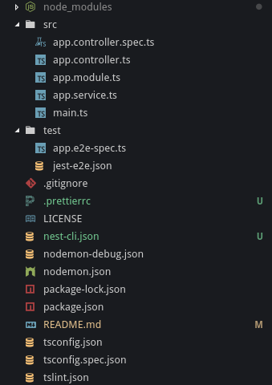

# Installation


Article en cours de rédaction


## Installer nest-cli

Installer l'outil en ligne de commande de façon globale :

```bash
$ npm i -g @nestjs/cli
```

## Initialiser le projet

Création du projet avec les éléments par défaut :

```bash
$ nest new nest-project

⚡️  Creating your Nest project...
🙌  We have to collect additional information:

? description : An application using nest
? version : 0.0.0
? author : PapsOu

💥  Thank you for your time!

CREATE /nest-tutorial/.prettierrc (51 bytes)
CREATE /nest-tutorial/README.md (3441 bytes)
CREATE /nest-tutorial/nodemon-debug.json (163 bytes)
CREATE /nest-tutorial/nodemon.json (132 bytes)
CREATE /nest-tutorial/package.json (1525 bytes)
CREATE /nest-tutorial/tsconfig.json (453 bytes)
CREATE /nest-tutorial/tsconfig.spec.json (135 bytes)
CREATE /nest-tutorial/tslint.json (1118 bytes)
CREATE /nest-tutorial/src/app.controller.spec.ts (588 bytes)
CREATE /nest-tutorial/src/app.controller.ts (266 bytes)
CREATE /nest-tutorial/src/app.module.ts (249 bytes)
CREATE /nest-tutorial/src/app.service.ts (138 bytes)
CREATE /nest-tutorial/src/main.ts (208 bytes)
CREATE /nest-tutorial/test/app.e2e-spec.ts (599 bytes)
CREATE /nest-tutorial/test/jest-e2e.json (183 bytes)
CREATE /nest-tutorial/nest-cli.json (84 bytes)

? Which package manager would you ❤️  to use? npm
✔ Take ☕️  or 🍺  during the packages installation process and enjoy your time

🚀  Successfully created project nest-tutorial
👉  Get started with the following commands:

$ cd nest-tutorial
$ npm run start
```

Notre projet contient désormais les éléments suivants :



## Le point d'entrée

Le fichier `main.ts` est le point d'entrée de notre application. Il contient peu de choses mais cela suffit à créer l'application et à lancer le serveur node.js.



```typescript
import { NestFactory } from '@nestjs/core';
import { AppModule } from './app.module';

async function bootstrap() {
  const app = await NestFactory.create(AppModule);
  await app.listen(3000);
}
bootstrap();
```



## Le module principal

Comme pour Angular, toute application doit comporter au moins un module. Il est possible \(et même plutôt conseillé\) de faire des modules séparés selon les fonctionnalités principales de notre application.


Cette bonne pratique s'appelle [Feature Module](https://angular.io/guide/feature-modules). La vocation de cette pratique est de compartimenter les fonctionnalités principales dans des modules dédiés. Avec Angular, cette méthode prend tout son sens lorsque vous optimisez l'application à l'aide des [Lazy Loading Feature Module](https://angular.io/guide/lazy-loading-ngmodules). Mais rien ne nous empêche de conserver cette bonne pratique sans forcément avoir un objectif d'optimisation.


Voici le contenu de notre module principal :



```typescript
import { Module } from '@nestjs/common';
import { AppController } from './app.controller';
import { AppService } from './app.service';

@Module({
  imports: [],
  controllers: [AppController],
  providers: [AppService],
})
export class AppModule {}
```



Le [décorateur](https://docs.nestjs.com/custom-decorators)`@Module` permet la configuration du module et de ses éléments le constituant : Contrôleurs, Services, Modules et/ou Services dépendants, Configuration, etc.

Dans notre example, le contrôleur `AppController`est déclaré et sera géré par Nest \(notamment pour le routing\). Le service `AppService` est également déclaré dans la section `providers`.


Pour exposer un service \(ou tout autre élément d'un module\), il suffit de l'ajouter dans la section `exports` de la configuration du module.

Exemple :

```typescript
@Module({
  imports: [],
  controllers: [AppController],
  providers: [AppService],
  exports: [AppService],
})
```

Le service `AppService` sera donc disponible pour les autres modules ayant importé notre module.


## Un service basique

Un exemple de service a été généré par Nest



```typescript
import { Injectable } from '@nestjs/common';

@Injectable()
export class AppService {
  root(): string {
    return 'Hello World!';
  }
}
```



Ce service expose simplement une méthode retournant la chaîne `Hello World!`.

## Un contrôleur

Un contrôleur basique est également généré lors de l'installation.



```typescript
import { Get, Controller } from '@nestjs/common';
import { AppService } from './app.service';

@Controller()
export class AppController {
  constructor(
    private readonly appService: AppService
  ) {}

  @Get()
  root(): string {
    return this.appService.root();
  }
}
```



Il appelle notre service `AppService` afin d'afficher la chaîne `Hello World!`.


Ce contrôleur montre un exemple d'injection de dépendance par constructeur. Nest propose également l'[injection de dépendance sur des propriétés](https://docs.nestjs.com/providers) \(section _**Property-based injection**_\), mais cette méthode n'est pas conseillée par l'équipe Nest.



